# Scalable Robot–Target Interception Planner

## Overview

This project implements a time-aware interception planner for a robot navigating a weighted 2D grid with obstacles. The objective is to intercept a moving target while minimizing accumulated traversal cost (movement + waiting), rather than minimizing arrival time.

At each timestep, the planner treats interception as a bounded multi-goal search over the remaining future timesteps of the target’s trajectory. For each traversable grid cell, it precomputes the earliest relative timestep `k` at which the target will occupy that cell. During search, a cell is considered a feasible interception if the robot can reach it in `s` steps and `s <= k`.

Waiting is explicitly modeled as remaining in place and paying the traversal cost of the interception cell for each extra timestep before the target arrives. The planner selects the feasible interception with minimum total cost, breaking ties by earlier interception time.

To improve efficiency and stability across timesteps, the planner:

- Bounds search by the remaining target horizon  
- Skips stale priority queue states  
- Caches valid plans across timesteps  
- Falls back to safe movement strategies when interception is infeasible  

---

## Build

```bash
g++ -O2 -std=c++17 runtest.cpp planner.cpp -o planner
```

## Run

```bash
./planner maps/map1.txt
```

---

## Visualization

```bash
python visualizer.py maps/map1.txt
```

---

## Example Results

The images below show example executions.

- The colored background represents traversal cost and obstacles.
- The green path is the robot trajectory.
- The yellow path is the target trajectory.

---

### Map 1 and Map 2

<p align="center">
  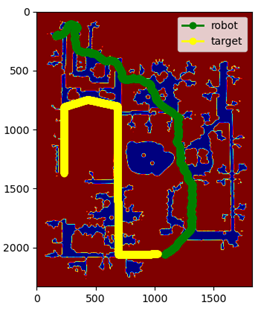
  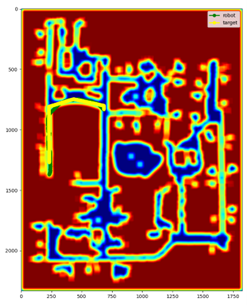
</p>

**Description:**  
These maps demonstrate interception in dense cost regions. The planner avoids high-cost areas and intercepts at a feasible future location instead of directly chasing the target’s instantaneous position.

---

### Map 3 and Map 4

<p align="center">
  
  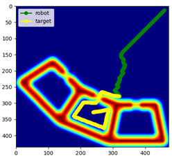
</p>

**Description:**  
These maps highlight cost-aware behavior. Even when a geometrically shorter path exists, the planner chooses lower-cost routes and times interception using the earliest feasible target arrival.

---

### Map 5 and Map 6

<p align="center">
  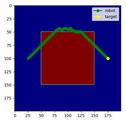
  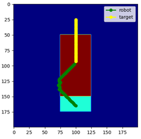
</p>

**Description:**  
These scenarios emphasize waiting behavior. The robot may arrive early at a low-cost interception cell and remain there rather than continue moving into higher-cost terrain.

---

### Map 7 and Map 8

<p align="center">
  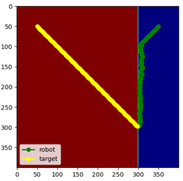
  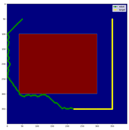
</p>

**Description:**  
These maps show bounded-horizon behavior. The planner restricts exploration to the remaining target trajectory window and selects the minimum total-cost feasible interception.

---

### Map 9 and Map 10

<p align="center">
  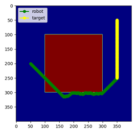
  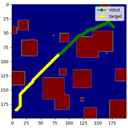
</p>

**Description:**  
These larger and more cluttered environments demonstrate robustness. The planner maintains feasibility, avoids obstacles, and selects interception points that balance cost and timing.

---

### Map 11 and Map 12

<p align="center">
  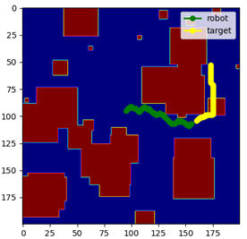
  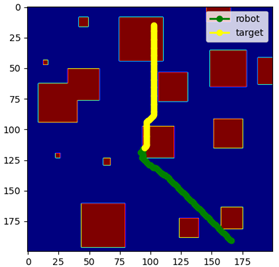
</p>

**Description:**  
These maps stress-test the planner in obstacle-dense settings. Even when direct interception is constrained, the planner remains stable, cost-aware, and produces valid actions under dynamic conditions.

---

## Key Properties

- Time-aware multi-goal interception  
- Cost-minimizing objective (movement + waiting)  
- Horizon-bounded search  
- Lexicographic ordering by (steps, cost)  
- Plan caching across timesteps  
- Guaranteed valid output action  

---

## Summary

The planner balances feasibility, cost optimality, and runtime stability under dynamic constraints. It avoids naive chasing behavior by reasoning over future target occupancy, explicitly models waiting cost, and ensures robustness through bounded search and structured fallback strategies.